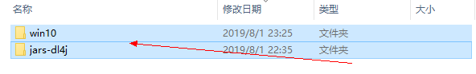
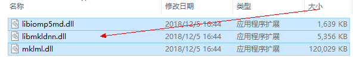
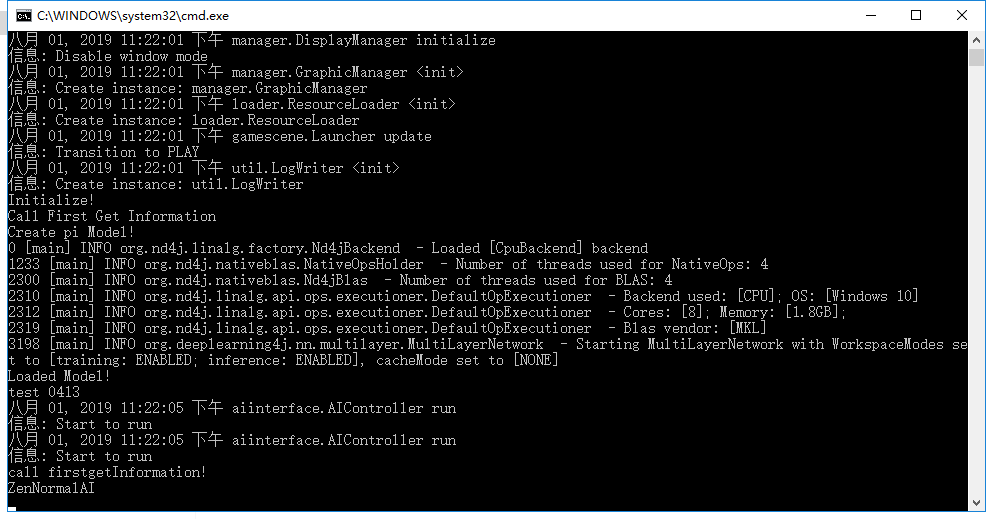

# Fighting-Game-AI

## **Introduction**

Rolling Fighting Bots use a java-based neural network libraries which is called **DeepLearning4j**. There are some jars (from **DeepLearning4j**) should be put  into the platform. For easy to be replicated, here we provide the roadmap. Notice it is just tested on Win 10.

## **Rolling Horizon Evolution Algorithm (RHEA) PART**  （Main Contributor: Zhentao Tang）

### Dependency Installation for Execution

For Win10, there are 2 related directories in directory **Dependency** and they are **jars-dl4j** and /**win10/dll**. DeepLearning4j jars are in **jars-dl4j** while windows DLLs are in **win10/dll**.  

​		
fig.1. Selected directories forwin 10.

 

Firststep, 73 Deeplearning4j jars are in directory **jars-dl4j** and all these jars have to be directly placed into dependencylib of FTG which is presented in fig 2. 

             
fig.2. Put thedeeplearning4j jars into FTG platform.
 

 

Secondstep, put all these three dlls directly in **C:\Windows**for the cpu library execution.

   
 fig.3. Three DLLs are put into **C:\Windows**  

 

Last Step, run the **FightingICE.bat** in fig.2. Then enjoy it!

   
 fig.4. Run the bat successfully.  

### Characteristics of Rolling Fighting Bot
- The main class is RHEA_PI.java (2019) or ERHEA_PI.java (2020). 
- The weights of opponent and character are loaded from **aiData/RHEA_PI** and **aiData/EHREA_PI** respectively. And the weights are automatically saved at **aiData/RHEA_PI** and **aiData/EHREA_PI** respectively during the fighting.
- Requirments:
    1) Jars of DeepLearning4j are all in directory **Dependency/jars-dl4j** and they should be put info FTG4.x/lib.
    2) DLLs of CPU library are all in **Dependency/win10/dll** and they have to be placed into **C:\Windows**.

## **Reinforcement Learning (RL) Part**

### **EmcmAI**  (Main Contributor: Yuanheng Zhu)

- EmcmAI is a RL-based bot that uses a policy network to fight against opponents.
- The policy network is trained by Proximal Policy Optimization (PPO) and by playing against participating bots in the competitions of last few years.
- During the training, authors design an Elo-based opponent-selection mechanism, so that too weak bots will not appear frequently as opponents.
- Here is java-based running version to meet the requirement of real-time play.

#### Content
  There are three folders in this directory: "ai", "aiData" and "src", each of which contains the files:
- ai/EmcmAi.jar: AI implementation in Java.
- aiData/EmcmAi/b{0_2}_399.csv and /EmcmAi/W{0_2}_399.csv
    - src: the source code for .jar bot.

#### Installation
   Copy "ai/EmcmAi.jar" to “FTG4.x/data/ai” directory, then copy "aiData/EmcmAi/" folder and its contents to "FTG4.x/data/aiData/".

#### RUN
   Launch the FightingICE and select EmcmAi and the opponent. Then enjoy the game.

### **CYR_AI**  (Main Contributor: YuRou Chen)
- CYR_AI is also a RL-based bot that uses Proximal Policy Optimization (PPO) to train the AI.
- It is trained with TensorFlow Keras and with multi-threading.
- The policy of action choice is made by roulette.

#### Content
  There are three folders in this directory: "ai", "aiData" and "src", each of which contains the files:
- ai/CYR_AI.jar: AI implementation in Java.
- aiData/CYR_AI/***.csv: They are the weights of each mode and character.
    - src: the source code for .jar bot.

#### Installation and RUN
   They are the same as above.

## More Information
Please refer to [FTGAI-Competition](http://www.ice.ci.ritsumei.ac.jp/~ftgaic/index-R.html).

Peprint version paper: [Enhanced Rolling Horizon Evolution Algorithm with Opponent Model Learning: Results for the Fighting Game AI Competition](https://arxiv.org/pdf/2003.13949.pdf)

